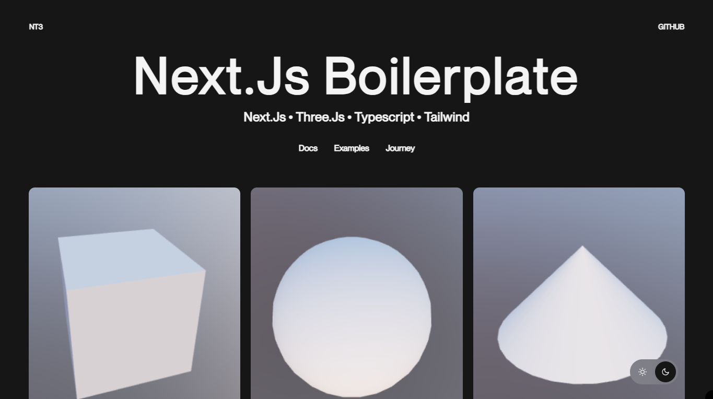

<a href="https://github.com/whosramoss/nt3">
  
  <h1 align="center">NT3</h1>
</a>

<p align="center">
  This template provides a starting point for building Next.js apps with Tailwind, TypeScript and Three.js.
</p>

<div align="center">
  
  
  
  
  
  <br/>
  
  
  
   
</div>
<br/>

<br/>


## How to install ⚡

```bash
  # Clone the project
  git clone https://github.com/whosramoss/nt3/

  # Go to the project directory
  cd nt3

  # Install dependencies
  npm install

  # Start the server 
  npm run dev
```

## How to build ⚡
- Before generating the build, don't forget to update the [metadata](./src/shared/meta.ts) file and set ```isLocalMetadata = false```.
- To generate a static compilation, the [next.config.mjs](./next.config.mjs) file must have the object below :
```bash
const staticbuild = {
  distDir: 'build',
  output: 'export',
  trailingSlash: true,
}
```
- Run the command:
```bash
  npm run build
```
## Structure 📂

- [src](./src/) – Add all folders below
  - [app](./src/app/) – Contains pages, layouts, and api routes
  - [client](./src/client/) – Contains components, hooks, providers, and styles
  - [server](./src/server/) – Contains schemas and services
  - [shared](./src/shared/) – Contains methods, types, enums and constants that will be used in more than one place in the application

## Framework and Packages 🦾
- [Next.js](https://nextjs.org/) 
- [TypeScript](https://www.typescriptlang.org/) 
- [Prettier](https://prettier.io/)
- [ESLint](https://eslint.org/) 
- [Tailwind CSS](https://tailwindcss.com/) 
- [Framer Motion](https://framer.com/motion) 
- [Zod](https://zod.dev/) 

## Hooks ⚡
- [useAnimationCursor](./src/client/hooks/useAnimationCursor.ts)
- [useAnimationFadeIn](./src/client/hooks/useAnimationFadeIn.ts)
- [useApiFetch](./src/client/hooks/useApiFetch.ts)


## Contributing 📄
If you want to contribute to `nt3`, please make sure to review the [contribution guidelines](https://github.com/whosramoss/nt3/blob/master/CONTRIBUTING.md). This project makes use of [GitHub issues](https://github.com/whosramoss/nt3/issues) for
tracking requests and bugs.

## License 📄

MIT License. [LICENSE](./LICENSE)

## Author ✍️

Gabriel Ramos ([@whosramoss](https://github.com/whosramoss))

